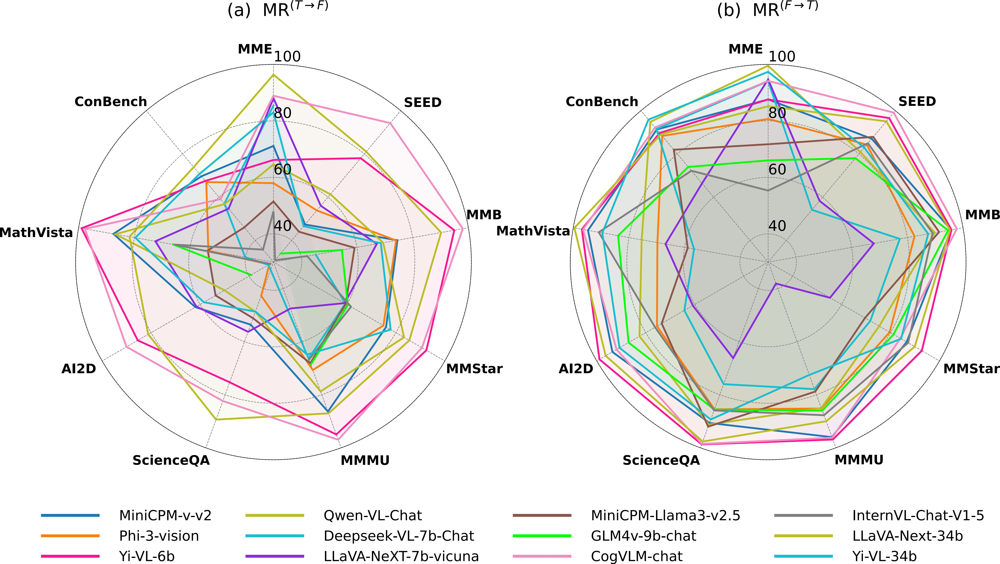

<h3 align="center">Exploring Response Uncertainty in MLLMs : An Empirical Evaluation Under Misleading Scenarios</h1>
<p align="center">
  <a href="https://arxiv.org/pdf/2411.02708" target="_blank">
    
  </a>
  &nbsp;&nbsp;
  
</p>

---
[2025/08/21] 🎉🎉🎉 Our work has been accepted to EMNLP 2025 Main! 


## 🎯 Overview
We reveal a **response uncertainty** phenomenon: across **nine** datasets, **twelve** open-source MLLMs overturn a previously correct answer after a single deceptive cue.
* **Two-stage evaluation + MUB.** We propose a two-stage misleading-instruction evaluation and the **misleading rate** metric, then curate the **Multimodal Uncertainty Benchmark (MUB)**—image–question pairs stratified into **low / medium / high** difficulty by how many of twelve MLLMs they mislead.
* **High uncertainty & robustness gains.** On **12 open-source + 5 closed-source** models, average misleading rates **exceed 86%** (**67.19% explicit**, **80.67% implicit**). A **2,000-sample mixed-instruction** fine-tuning reduces misleading to **6.97% (explicit)** and **32.77% (implicit)**, improves **consistency by ~29.37%**, and slightly improves accuracy on standard benchmarks.


<p align="center">
  
</p>





---
### ⚙️ Environment Installation

Before running the code, set up the required environments for: `glm` , `llava`, `MiniCPM-V`, `mmstar`.

📥 **Installation Steps:**  
1. Navigate to the `env` folder.
2. Download and install the corresponding `.yml` environment files:
   ```bash
   conda env create -f env/glm.yml
   conda env create -f env/llava.yml
   conda env create -f env/MiniCPM-V.yml
   conda env create -f env/mmstar.yml
   ```
3. Activate the required environment:
   ```bash
   conda activate <ENV_NAME>
   ```

---

### 📂 Data Preparation

**Download the Multimodal Uncertainty Benchmark (MUB) dataset** [here](https://drive.google.com/drive/folders/1_SyC9ZedMQdq0scxfo7DCgRporoK9kjt?usp=drive_link).  
Extract and place the downloaded images into the `extract_img_all` folder.

**Evaluated Open-source and Close-source Models:**  
```MiniCPM-v-v2; Phi-3-vision; YiVL-6b; Qwen-VL-Chat; Deepseek-VL-7b-Chat; LLaVA-NeXT-7b-vicuna; MiniCPM-Llama3-v2.5; GLM4V-9Bchat; CogVLM-chat; InternVL-Chat-V1-5; LLaVA-Next-34b; Yi-VL-34b; GPT-4o; Gemini-Pro; Claude3-OpusV; Glm-4V ```


---

### 🔍 Explicit Misleading Experiment
```bash
bash MR_test.sh
```

---

### 🔄 Implicit Misleading Experiment

#### 🛠️ Step 1: Generate Implicit Misleading Samples
1. Open `implicit/misleading_generate/my_tool.py`.  
2. Fill in your **API Key**.  
3. Run:
   ```bash
   bash implicit/misleading_generate/mislead_generate.sh
   ```

#### 📊 Step 2: Run the Implicit Misleading Test
Use the generated data in `implicit/mislead_output`:
```bash
bash implicit/Implicit_MR_test/implicit_MR_test.sh
```

---

## 📈 Results & Visualization

Results are saved in:
- 📁 `result/test_dataset_6`
  - **`.jsonl`** → Detailed outputs
  - **`.txt`** → Model's **Misleading Rate (MR)**

### 📊 Convert Results to Table Format
1. Open `extract2table/extract2table.py`
2. Modify `txt_folder_paths` as needed.
3. Run:
   ```bash
   python extract2table/extract2table.py
   ```
4. The formatted table is saved in:
   📁 `extract2table/Tables/`

---

## 📚 Citation

If you use this work, please cite:

```bibtex
@article{dang2024exploring,
  title={Exploring response uncertainty in mllms: An empirical evaluation under misleading scenarios},
  author={Dang, Yunkai and Gao, Mengxi and Yan, Yibo and Zou, Xin and Gu, Yanggan and Liu, Aiwei and Hu, Xuming},
  journal={arXiv preprint arXiv:2411.02708},
  year={2024}
}
```

---

## 📬 Contact
For any issues, please open a GitHub issue or reach out via email:  **yunkaidang1@gmail.com**

